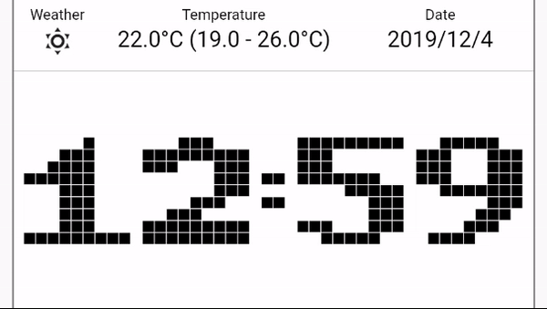
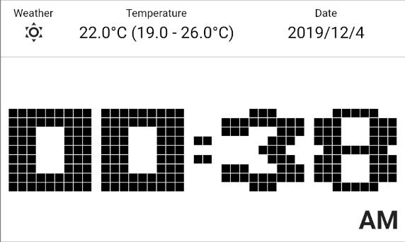
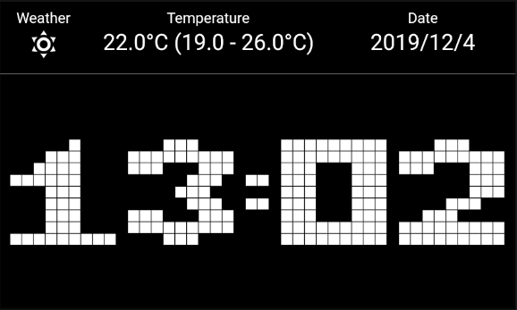

# Digital Clock

Digital pixel clock

Light theme

Dark theme

# Reason
I've been wanting to create a watchface with this kind of animation since the era of pebble, but can't as it will drain the battery with the number of frame changes every minute.

Since Flutter-Clock competition uses Lenovo Smart Clock as the target (which don't use battery), i can finally create this watchface.

# Credit
Created by Vincent U. (MSVCode) for Flutter-Clock competition.

# License
MIT License.